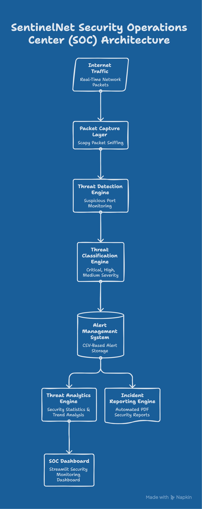
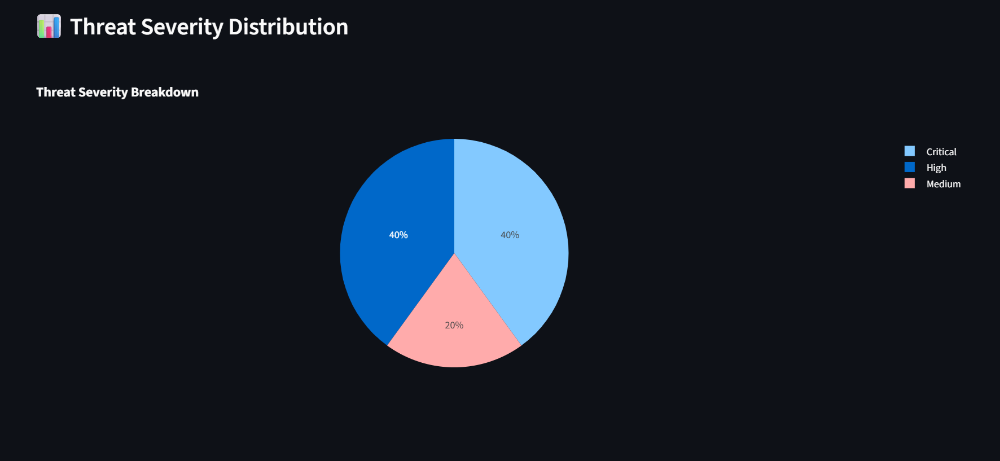
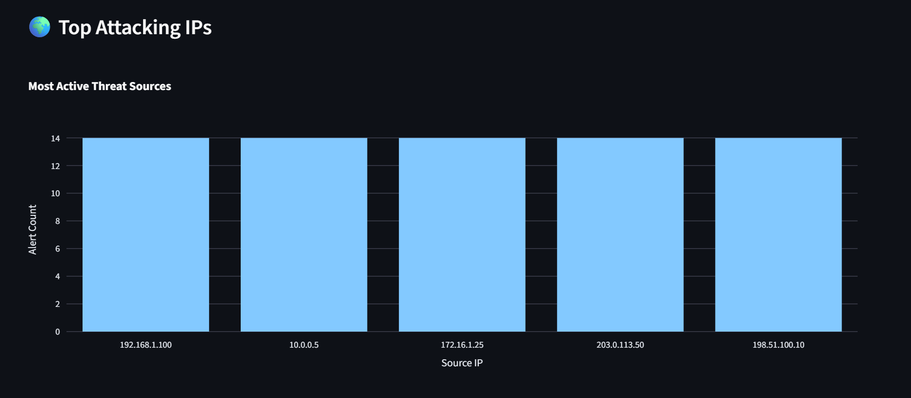
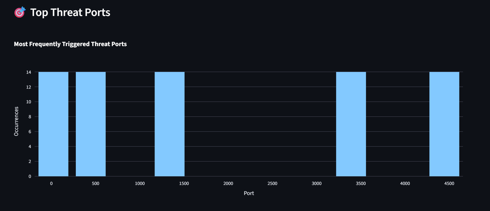

# SentinelNet

## Real-Time Network Threat Detection and Security Monitoring Platform

**Cybersecurity • SOC Monitoring • Threat Detection • Network Security • Python • Streamlit • Scapy**

SentinelNet is a Security Operations Center (SOC)-inspired cybersecurity monitoring platform developed using Python. The platform captures network traffic, detects suspicious activities, generates security alerts, performs threat analytics, and visualizes incidents through an interactive dashboard.

The project demonstrates practical cybersecurity concepts including packet analysis, threat detection, alert management, security analytics, and automated incident reporting.

---

# Project Highlights

* Real-time network packet monitoring
* Automated threat detection engine
* Suspicious port identification
* Alert logging and incident tracking
* Interactive SOC dashboard
* Threat intelligence visualization
* Automated PDF security reporting
* Security analytics and trend monitoring

### Testing Results

* Total Alerts Generated: **70**
* Critical Alerts: **28**
* High Alerts: **28**
* Medium Alerts: **14**
* Security Analytics Dashboard Implemented
* Automated Incident Reporting Enabled

---

# Features

## Real-Time Packet Capture

Captures network traffic using Scapy and extracts relevant packet information for security analysis.

## Threat Detection Engine

Analyzes observed ports and services against predefined threat rules to identify suspicious activity.

## Alert Management

Automatically generates and stores security alerts categorized by severity.

## Security Analytics

Processes threat data and generates security insights for analysts.

## Threat Intelligence Summary

Provides a high-level overview of detected threats and risk levels.

## Interactive Dashboard

Visualizes threat statistics, alert distribution, and security trends using Streamlit and Plotly.

## PDF Incident Reporting

Generates structured security reports for documentation and incident response purposes.

---

# Technologies Used

| Technology   | Purpose                   |
| ------------ | ------------------------- |
| Python       | Core Development          |
| Scapy        | Packet Capture & Analysis |
| Pandas       | Data Processing           |
| Streamlit    | Dashboard Development     |
| Plotly       | Data Visualization        |
| ReportLab    | PDF Report Generation     |
| Git & GitHub | Version Control           |

---

# System Architecture



### Architecture Overview

SentinelNet follows a layered cybersecurity monitoring architecture:

Network Traffic

↓

Packet Capture Layer

↓

Threat Detection Engine

↓

Alert Generation Module

↓

Analytics Engine

↓

Dashboard Interface

↓

Incident Report Generator

This architecture enables real-time threat monitoring, incident detection, security analytics, and reporting.

---

# Dashboard Preview

## Main Security Dashboard


The main dashboard provides a centralized view of security alerts, threat statistics, and overall monitoring status.

---

## Threat Severity Distribution



Displays alert distribution across Critical, High, and Medium severity levels.

---

## Security Analytics Overview



Provides statistical insights into detected threats and monitoring performance.

---

## Threat Intelligence Summary



Summarizes security incidents and highlights high-risk activities.

---

## Threat Activity Timeline


Visualizes threat occurrence patterns over time to assist with incident investigation.

---

# Project Structure

```text
SentinelNet
│
├── alerts
│   └── alerts.csv
│
├── analytics
│   └── stats.py
│
├── dashboard
│   └── dashboard.py
│
├── detection_engine
│   ├── detector.py
│   └── port_scan.py
│
├── logs
│   └── network_log.csv
│
├── packet_capture
│   └── capture.py
│
├── reports
│   ├── generate_report.py
│   └── SentinelNet_Report.pdf
│
├── screenshots
│   ├── dashboard_main.png
│   ├── dashboard_analytics_1.png
│   ├── dashboard_analytics_2.png
│   ├── dashboard_analytics_3.png
│   └── dashboard_timeline.png
│
├── architecture.png
├── requirements.txt
└── README.md
```

---

# Installation

Clone the repository:

```bash
git clone https://github.com/darshnoor30/SentinelNet.git
cd SentinelNet
```

Install dependencies:

```bash
pip install -r requirements.txt
```

---

# Usage

## Run Packet Capture

```bash
python packet_capture/capture.py
```

## Run Threat Detection

```bash
python test_detector.py
```

## Run Dashboard

```bash
streamlit run dashboard/dashboard.py
```

---

# Security Report

SentinelNet automatically generates PDF-based incident reports containing:

* Threat statistics
* Severity breakdown
* Security score
* Threat analysis
* Security recommendations
* Incident summaries

Generated Report:

```text
reports/SentinelNet_Report.pdf
```

---

# Skills Demonstrated

* Python Programming
* Cybersecurity Fundamentals
* Network Security
* Packet Analysis
* Threat Detection
* Security Monitoring
* Incident Reporting
* Data Analytics
* Dashboard Development
* Streamlit Development
* Git & GitHub
* Technical Documentation

---

# Challenges Solved

* Implemented packet capture and traffic inspection
* Developed custom threat detection logic
* Managed alert classification and logging
* Built interactive security analytics dashboards
* Generated automated security reports
* Organized project structure for maintainability
* Integrated multiple cybersecurity components into a single platform

---

# Future Enhancements

* Machine Learning-Based Threat Detection
* Threat Intelligence Integration
* SIEM Integration
* Cloud Deployment
* Email Alerting System
* Automated Incident Response
* Database-Based Alert Storage
* Real-Time Notification Services
* Advanced Security Analytics

---

# Learning Outcomes

Through the development of SentinelNet, the following practical skills were gained:

* Understanding Security Operations Center workflows
* Network packet inspection techniques
* Threat classification methodologies
* Security dashboard design
* Incident reporting processes
* Cybersecurity project development
* Open-source security tool integration

---

# Developer

**Darshnoor Kaur**

B.Tech Computer Science Engineering

Cybersecurity Enthusiast | Python Developer | Security Monitoring & Threat Detection

---

# Repository

GitHub Repository:

https://github.com/darshnoor30/SentinelNet
