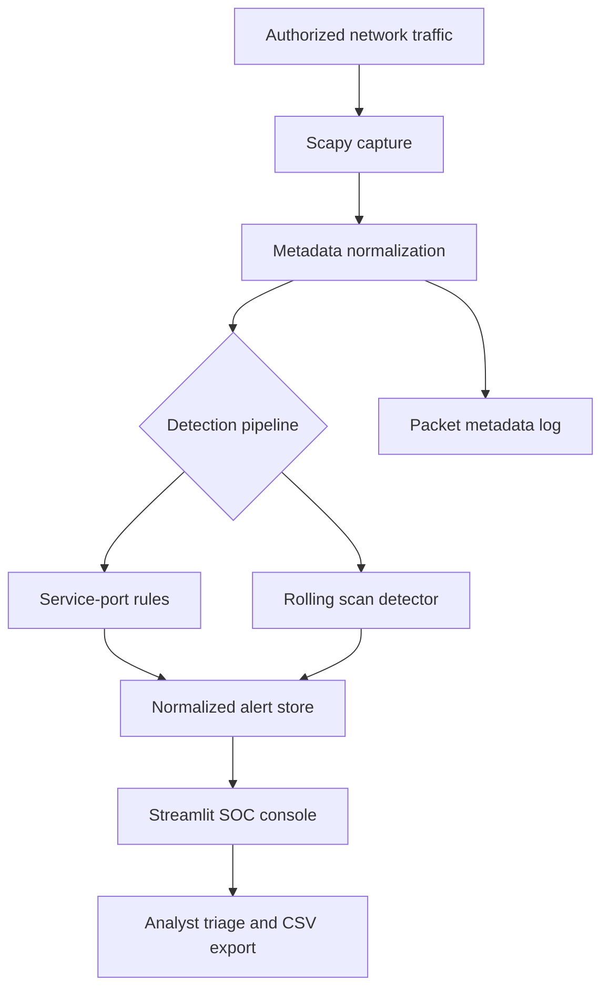

<div align="center">

# SentinelNet

### Explainable network threat detection with an analyst-first SOC dashboard

[](https://github.com/darshnoor30/SentinelNet/actions/workflows/ci.yml)
[](https://www.python.org/)
[](LICENSE)
[](SECURITY.md)

**Python · Scapy · Streamlit · Plotly · Pandas · Pytest · GitHub Actions**

</div>

SentinelNet is a portfolio-scale Security Operations Center (SOC) project that
turns live network metadata into explainable alerts and a filterable analyst
queue. It combines packet capture, rule-based service detections, rolling
port-scan analysis, normalized CSV telemetry, and a Streamlit dashboard.

The project is designed to demonstrate more than a visual dashboard: detection
logic is separated from capture, modules have no import-time capture side
effects, data contracts are explicit, runtime telemetry is excluded from Git,
and automated tests run against Python 3.10 and 3.12.

> **Scope:** SentinelNet is a defensive learning project, not a replacement for
> an enterprise IDS/IPS or SIEM. A port match is a triage signal—not proof of
> compromise.

## Dashboard


The console auto-refreshes and provides severity/source filters, transparent
risk scoring, service and timeline analytics, a priority-sorted investigation
queue, and CSV export.

## Try it in under two minutes

The safe demo uses only [IANA documentation address ranges](https://www.rfc-editor.org/rfc/rfc5737)
and does not require administrator privileges or live packet capture.

```bash
git clone https://github.com/darshnoor30/SentinelNet.git
cd SentinelNet
python -m venv .venv
```

Activate the environment (`.venv\Scripts\activate` on Windows or
`source .venv/bin/activate` on macOS/Linux), then run:

```bash
python -m pip install -r requirements.txt
python -m scripts.generate_demo_data
streamlit run dashboard/dashboard.py
```

To replace previously generated demo telemetry, use
`python -m scripts.generate_demo_data --force`. Do not use `--force` on evidence
you need to retain.

## Engineering highlights

| Capability | Implementation | Engineering signal |
|---|---|---|
| Packet telemetry | Scapy extracts IP, protocol, and port metadata without intentionally storing payloads | Privacy-aware data minimization |
| Service rules | Immutable, typed rules generate structured alert objects | Explainable and testable detections |
| Scan detection | Unique destination ports tracked in a rolling window with per-source cooldown | Stateful behavior with duplicate control |
| Alert storage | Stable CSV schema with legacy-header compatibility | Explicit contract and safe migration path |
| SOC console | Filters, metrics, timelines, priority queue, auto-refresh, and export | Analyst-centered product thinking |
| Quality gates | Ruff, Pytest, coverage threshold, and a two-version CI matrix | Reproducible engineering workflow |
| Repository hygiene | MIT license, security policy, contribution guide, Dependabot | Open-source readiness |

## Architecture


```mermaid
flowchart TD
    A[Authorized network traffic] --> B[Scapy capture]
    B --> C[Metadata normalization]
    C --> D{Detection pipeline}
    D --> E[Service-port rules]
    D --> F[Rolling scan detector]
    E --> G[Normalized alert store]
    F --> G
    C --> H[Packet metadata log]
    G --> I[Streamlit SOC console]
    I --> J[Analyst triage and CSV export]
```

The capture adapter is intentionally thin. Detection and storage are injected
into `PacketProcessor`, which keeps the core behavior deterministic and easy to
exercise with synthetic Scapy packets.

## Detection model

SentinelNet currently evaluates **destination** ports. This avoids treating a
server response from a well-known source port as a second inbound threat.

| Signal | Default severity | Analyst rationale |
|---|---:|---|
| FTP / 21 | Medium | Cleartext protocol exposure |
| Telnet / 23 | High | Cleartext remote administration |
| SMB / 445 | High | Common discovery and lateral-movement surface |
| RDP / 3389 | Medium | Remote-access activity requiring allowlist context |
| TCP / 4444 | Critical | Common reverse-shell and security-testing convention |
| TCP / 1337 | Critical | Unexpected non-standard service requiring validation |
| 10 unique ports / 60 seconds | High | Potential network discovery; 60-second alert cooldown |

These rules prioritize explainability. Production-quality detection would add
asset context, directionality, baselines, protocol inspection, allowlists,
threat-intelligence enrichment, and correlation across multiple signals.

## Repository layout

```text
SentinelNet/
├── .github/                 # CI, Dependabot, and PR quality checklist
├── analytics/               # Reusable alert summary functions and CLI
├── dashboard/               # Streamlit SOC console
├── detection_engine/        # Service rules, alert model/store, scan detector
├── packet_capture/          # Scapy adapter and packet metadata logger
├── scripts/                 # Safe deterministic demo-data generator
├── screenshots/             # Recruiter-facing product preview
├── tests/                   # Unit and integration-style packet tests
├── CONTRIBUTING.md
├── SECURITY.md
├── pyproject.toml
└── requirements.txt
```

Runtime files are created only when needed:

- `alerts/alerts.csv` — normalized detections used by the dashboard
- `logs/network_log.csv` — packet metadata (no intentional payload storage)

Both paths are ignored by Git because network telemetry can be sensitive.

## Run authorized live capture

Packet capture may require an elevated terminal. Windows users should install
[Npcap](https://npcap.com/) with WinPcap API compatibility; Linux/macOS users
need a working libpcap installation.

```bash
python -m packet_capture.capture --count 100
```

Useful options:

```text
--interface NAME   capture from a specific interface
--count N          stop after N packets; 0 runs continuously
--filter BPF       override the default ip/TCP/UDP BPF filter
--quiet            suppress per-packet console output
```

Only capture traffic on a system or network you own or have explicit permission
to monitor.

## Analyze alerts from the terminal

```bash
python -m analytics.stats
```

Example:

```text
Threat statistics
================================
Total alerts    : 15
Critical        : 4
High            : 7
Medium          : 4
Low             : 0
```

## Alert schema

| Field | Meaning |
|---|---|
| `Timestamp` | UTC ISO-8601 observation time |
| `SourceIP` / `DestinationIP` | Observed endpoints |
| `Protocol` / `Port` | Transport protocol and destination port |
| `Service` | Human-readable matched service |
| `Severity` | Critical, High, Medium, or Low |
| `Category` | Analyst-oriented detection category |
| `Description` | Explainable reason the signal was raised |

## Tests and quality checks

```bash
python -m pip install -r requirements-dev.txt
ruff check .
ruff format --check .
pytest --cov=analytics --cov=detection_engine --cov=packet_capture --cov-report=term-missing
```

The suite covers rule matches and benign ports, CSV schema behavior, legacy
compatibility, rolling-window scan detection, cooldown behavior, packet
normalization, destination-port semantics, analytics, and CLI validation.

## Roadmap

- [ ] PCAP replay mode for fully reproducible investigations
- [ ] SQLite/PostgreSQL storage with alert lifecycle states
- [ ] Asset allowlists and environment-specific rule configuration
- [ ] GeoIP and threat-intelligence enrichment with local caching
- [ ] Authentication and role-based access for deployed dashboards
- [ ] JSON/webhook export for SIEM and SOAR integrations

## Responsible use and contributing

Read [SECURITY.md](SECURITY.md) before handling telemetry or reporting a
vulnerability. Contributions are welcome through the workflow in
[CONTRIBUTING.md](CONTRIBUTING.md).

## Author

**Darshnoor Kaur** — B.Tech Computer Science Engineering student focused on
SOC operations, network security, and defensive Python engineering.

[GitHub](https://github.com/darshnoor30) ·
[Portfolio](https://darshnoor30.github.io/)

## License

Released under the [MIT License](LICENSE).
